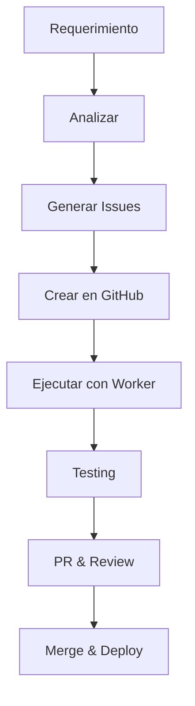

# 🚀 MANUAL DE USO - GENERADOR DE ISSUES JANOME
## Sistema Completo de Creación de Issues Atómicas

---

## 📋 **OVERVIEW DEL SISTEMA**

Este sistema te permite crear **issues atómicas** y bien estructuradas para el proyecto Janome de manera escalable. Consta de dos herramientas principales que funcionan en conjunto:

1. **`claude-issue-generator.sh`** → **CREAR** issues nuevas
2. **`claude-issue-worker.sh`** → **EJECUTAR** issues existentes

### **🎯 FLUJO COMPLETO**
```
📝 Requerimiento → 🔍 Análisis → 📋 Issues → ⚙️ Desarrollo → ✅ Entrega
```

---

## ⚡ **QUICK START**

### **1. Analizar un Requerimiento**
```bash
./claude-issue-generator.sh analyze "Implementar sistema de evaluaciones post-taller con ratings y comentarios"
```

### **2. Generar Issue Específica**
```bash
./claude-issue-generator.sh generate EPIC-TALLERES "widget confirmacion asistencia"
```

### **3. Ejecutar Issue Creada**
```bash
./claude-issue-worker.sh 125 frontend
```

---

## 🔧 **COMANDOS DISPONIBLES**

### **📊 `analyze` - Análisis de Requerimientos**
Desglosa un requerimiento complejo en issues atómicas.

```bash
./claude-issue-generator.sh analyze "<descripción del requerimiento>"
```

**Ejemplos:**
```bash
# Análisis de sistema complejo
./claude-issue-generator.sh analyze "Sistema de evaluaciones con ratings, comentarios y métricas agregadas"

# Análisis de mejora específica
./claude-issue-generator.sh analyze "Optimizar rendimiento de la tabla de talleres para 1000+ registros"

# Análisis de integración
./claude-issue-generator.sh analyze "Integrar calendario externo con sync bidireccional"
```

### **📝 `generate` - Generación de Issues**
Crea una issue atómica completa siguiendo el protocolo C.I.D.E.R.

```bash
./claude-issue-generator.sh generate <EPIC> "<descripción de funcionalidad>"
```

**Ejemplos:**
```bash
# Feature simple
./claude-issue-generator.sh generate EPIC-TALLERES "toast de confirmación al crear taller"

# Feature medium
./claude-issue-generator.sh generate EPIC-DASHBOARD "widget estadísticas mensuales"

# Feature complex
./claude-issue-generator.sh generate EPIC-RECORDATORIOS "sistema confirmación manual"

# Fix de bug
./claude-issue-generator.sh generate EPIC-PERFORMANCE "optimizar queries asistentes"
```

### **✅ `validate` - Validación de Issues**
Valida que una issue cumple con los estándares de calidad.

```bash
./claude-issue-generator.sh validate <archivo_issue>
```

**Ejemplos:**
```bash
./claude-issue-generator.sh validate specs/01_FEATURES/[FEAT]-nueva-funcionalidad.md
./claude-issue-generator.sh validate specs/01_FEATURES/[FIX]-bug-timezone.md
```

### **📚 `list-epics` - Ver Épicas Disponibles**
Muestra todas las épicas y sus módulos.

```bash
./claude-issue-generator.sh list-epics
```

### **📄 `template` - Generar Template Vacío**
Crea un archivo template para completar manualmente.

```bash
./claude-issue-generator.sh template
```

---

## 🏗️ **ÉPICAS DISPONIBLES**

| Épica | Área | Módulos | Ejemplos de Issues |
|-------|------|---------|-------------------|
| **EPIC-TALLERES** | Gestión Core | Programación, Estados, Reportes | Confirmaciones, Widgets, Filtros |
| **EPIC-ASISTENTES** | Participantes | Perfiles, Equipos, Historial | Inscripciones, Validaciones |
| **EPIC-EQUIPOS** | Inventario | Catálogo, Tipos, Asignaciones | CRUD equipos, Compatibilidad |
| **EPIC-RECORDATORIOS** | WhatsApp | Cron Jobs, Templates, Stats | Automatización, Bulk sends |
| **EPIC-USUARIOS** | Auth/Permisos | Roles, Estados, Aprobaciones | Login, Roles, Moderación |
| **EPIC-IA-WHATSAPP** | Conversaciones | Chatbot, Escalamiento | IA responses, Context |
| **EPIC-DASHBOARD** | Analytics | Widgets, Gráficos, Exportes | KPIs, Reports, Visualización |
| **EPIC-PERFORMANCE** | Optimización | BD, Frontend, Worker | Queries, Cache, Monitoring |

---

## 📋 **TIPOS DE ISSUES Y COMPLEJIDAD**

### **🏷️ Tipos Disponibles**
- **[FEAT]** - Nueva funcionalidad
- **[FIX]** - Corrección de bug
- **[ENHANCE]** - Mejora de funcionalidad existente
- **[REFACTOR]** - Reorganización de código
- **[DB]** - Cambios de base de datos
- **[DOC]** - Documentación

### **📏 Niveles de Complejidad**

#### **🟢 SIMPLE** (15min - 2h)
- Un archivo/componente afectado
- Sin cambios de BD
- Testing manual suficiente

**Ejemplos:**
- Toast de confirmación
- Cambio de textos/copy
- Fix de validación simple
- Ajuste de estilos CSS

#### **🟡 MEDIUM** (2h - 6h)
- 2-5 archivos afectados
- Posibles cambios menores de BD
- Nuevos hooks/services

**Ejemplos:**
- Nuevo componente UI
- Widget de dashboard
- Optimización de performance
- Nueva funcionalidad en módulo existente

#### **🔴 COMPLEX** (6h - 24h)
- Múltiples módulos afectados
- Cambios significativos de BD
- Testing comprehensivo

**Ejemplos:**
- Nuevo módulo completo
- Integración nueva API
- Migración de sistema
- Refactor arquitectónico

---

## 📝 **EJEMPLOS PRÁCTICOS COMPLETOS**

### **Ejemplo 1: Feature Simple**

```bash
# 1. Generar la issue
./claude-issue-generator.sh generate EPIC-TALLERES "añadir toast éxito crear taller"

# 2. Crear issue en GitHub con el contenido generado

# 3. Ejecutar desarrollo
./claude-issue-worker.sh 127 frontend

# Resultado: Issue #127 implementada en ~1 hora
```

### **Ejemplo 2: Requerimiento Complejo**

```bash
# 1. Analizar requerimiento completo
./claude-issue-generator.sh analyze "Sistema de evaluaciones post-taller con ratings 1-5, comentarios, métricas agregadas y dashboard de satisfacción"

# Output sugerido:
# ÉPICA PRINCIPAL: EPIC-TALLERES
# ISSUES SUGERIDAS:
# - [DB] Crear tabla evaluaciones (SIMPLE)
# - [FEAT] Componente rating widget (MEDIUM)
# - [FEAT] Form evaluación post-taller (MEDIUM)
# - [FEAT] Dashboard métricas satisfacción (COMPLEX)
# - [FEAT] Email recordatorio evaluación (MEDIUM)

# 2. Generar cada issue individual
./claude-issue-generator.sh generate EPIC-TALLERES "tabla base datos evaluaciones"
./claude-issue-generator.sh generate EPIC-TALLERES "componente rating 5 estrellas"
./claude-issue-generator.sh generate EPIC-TALLERES "formulario evaluación post taller"
./claude-issue-generator.sh generate EPIC-DASHBOARD "widget métricas satisfacción"
./claude-issue-generator.sh generate EPIC-RECORDATORIOS "email recordatorio evaluación"

# 3. Crear issues en GitHub en orden de dependencias

# 4. Ejecutar en orden lógico
./claude-issue-worker.sh 130 database    # Tabla BD
./claude-issue-worker.sh 131 frontend    # Rating widget
./claude-issue-worker.sh 132 frontend    # Form evaluación
./claude-issue-worker.sh 133 full-stack  # Dashboard
./claude-issue-worker.sh 134 worker      # Email automation
```

### **Ejemplo 3: Bug Fix**

```bash
# 1. Analizar el problema
./claude-issue-generator.sh analyze "Las fechas se muestran incorrectamente en diferentes zonas horarias"

# 2. Generar fix específico
./claude-issue-generator.sh generate EPIC-PERFORMANCE "fix timezone inconsistencia fechas"

# 3. Validar antes de crear issue
./claude-issue-generator.sh validate specs/01_FEATURES/[FIX]-timezone-dates.md

# 4. Ejecutar fix
./claude-issue-worker.sh 135 frontend
```

---

## 🔄 **WORKFLOW INTEGRADO**

### **📋 Proceso Completo de Desarrollo**



### **🎯 Pasos Detallados**

#### **FASE 1: Planificación**
1. **Analizar requerimiento** → `./claude-issue-generator.sh analyze`
2. **Revisar propuesta** → Ajustar si es necesario
3. **Generar issues atómicas** → `./claude-issue-generator.sh generate`
4. **Validar issues** → `./claude-issue-generator.sh validate`

#### **FASE 2: Creación**
1. **Crear issues en GitHub** → Con contenido generado
2. **Asignar labels y milestones** → Según épica y complejidad
3. **Establecer dependencias** → Usar GitHub dependencies
4. **Priorizar en backlog** → Orden lógico de desarrollo

#### **FASE 3: Ejecución**
1. **Ejecutar issue** → `./claude-issue-worker.sh [numero] [area]`
2. **Seguir protocolo C.I.D.E.R.** → Contextualizar, Iterar, Documentar, Ejecutar, Reflexionar
3. **Testing incremental** → Verificar cada paso
4. **Actualizar documentación** → specs/ correspondientes

#### **FASE 4: Entrega**
1. **Crear PR** → Con descripción detallada
2. **Code review** → Revisión de calidad
3. **Testing final** → QA comprehensive
4. **Merge y deploy** → Integración a producción

---

## 📊 **MÉTRICAS Y KPIs**

### **🎯 Métricas de Issues**
- **Atomicidad**: % issues completadas en una sesión
- **Precisión de estimación**: Tiempo real vs estimado
- **Calidad**: % issues sin bugs post-merge
- **Documentación**: % issues con specs actualizadas

### **📈 Dashboard de Épicas**
```bash
# Ver progreso de épicas
git log --grep="EPIC-TALLERES" --oneline
git log --grep="EPIC-DASHBOARD" --oneline
```

---

## 🚨 **TROUBLESHOOTING**

### **Problemas Comunes**

#### **Error: Claude Code no encontrado**
```bash
# Instalar Claude Code
curl -sSL https://claude.ai/install | sh

# Verificar instalación
claude --version
```

#### **Error: No se puede ejecutar script**
```bash
# Dar permisos de ejecución
chmod +x claude-issue-generator.sh
chmod +x claude-issue-worker.sh
```

#### **Error: Estructura de proyecto no válida**
```bash
# Verificar estructura necesaria
ls -la package.json src/ specs/
```

#### **Issues muy genéricas**
```bash
# Ser más específico en la descripción
# ❌ Malo: "mejorar dashboard"
# ✅ Bueno: "widget KPI asistencia mensual con gráfico de barras"
```

#### **Validación falla**
```bash
# Revisar criterios específicos
./claude-issue-generator.sh validate [archivo]
# Ajustar según feedback
# Volver a validar
```

---

## 📚 **MEJORES PRÁCTICAS**

### **✅ DO - Hacer**
- **Sé específico** → "Widget KPI asistencia" vs "mejorar dashboard"
- **Una funcionalidad por issue** → Atomicidad es clave
- **Usa el análisis** → Siempre analiza antes de generar
- **Valida antes de crear** → Evita issues mal estructuradas
- **Sigue el orden lógico** → Dependencias claras
- **Actualiza documentación** → Protocolo C.I.D.E.R.

### **❌ DON'T - No hacer**
- **Issues mega complejas** → Dividir en partes atómicas
- **Saltar la validación** → Siempre validar antes de GitHub
- **Mezclar épicas** → Una épica principal por issue
- **Ignorar dependencias** → Identificar prerequisites
- **Olvidar documentación** → Actualizar specs/ es obligatorio

### **🎯 Tips para Issues de Calidad**
1. **Título descriptivo** → `[FEAT]-(dd-mm-yyyy)-widget-confirmacion-asistencia`
2. **Contexto claro** → Qué, por qué, para quién
3. **Criterios específicos** → Cómo medir que está "terminado"
4. **Referencias técnicas** → Archivos, funciones, componentes exactos
5. **Estimación realista** → Basada en complejidad real

---

## 🔧 **INTEGRACIÓN CON HERRAMIENTAS**

### **GitHub Integration**
```bash
# Crear issue con template
gh issue create --title "[FEAT]-(27-01-2025)-widget-asistencia" --body-file issue-content.md

# Asignar labels
gh issue edit 127 --add-label "EPIC-TALLERES,frontend,medium"

# Ver progreso de épica
gh issue list --label "EPIC-TALLERES"
```

### **Claude Code Integration**
```bash
# Workflow completo
./claude-issue-generator.sh generate EPIC-TALLERES "nueva funcionalidad"
# → Crear issue en GitHub
./claude-issue-worker.sh 127 frontend
# → Desarrollo automático con Claude

# También se puede usar directamente
claude "Working on Janome issue #127"
```

### **Supabase Integration**
- **MCP automático** → Funciones BD consultadas en tiempo real
- **Contexto actualizado** → specs/03_DATABASE/ siempre referenciado
- **Validación de cambios** → BD changes validados

---

## 📅 **ROADMAP Y MEJORAS**

### **🔄 Próximas Mejoras**
1. **Dashboard de métricas** → Visualización de KPIs de issues
2. **Auto-estimación IA** → Estimación de complejidad más precisa
3. **Template personalizados** → Por tipo de funcionalidad
4. **Integración GitHub Actions** → Automation completa
5. **Analytics de productividad** → Métricas de desarrollo

### **🎯 Objetivos 2025**
- **90% issues atómicas** → Una funcionalidad por issue
- **<10% re-work** → Issues bien definidas desde el inicio
- **100% documentación** → specs/ siempre actualizados
- **Estimación ±20%** → Precisión en tiempo de desarrollo

---

## 📞 **SUPPORT Y RECURSOS**

### **📋 Recursos Disponibles**
- **CLAUDE.md** → Contexto del proyecto y reglas
- **specs/00_SYSTEM/_MANIFEST.md** → Estado global del sistema
- **specs/03_DATABASE/_DATABASE_OVERVIEW.md** → Funciones BD
- **CLAUDE-ISSUE-GENERATOR-STRATEGY.md** → Estrategia completa

### **🆘 Getting Help**
1. **Revisar documentación** → specs/ completa
2. **Validar issue** → `./claude-issue-generator.sh validate`
3. **Consultar épicas** → `./claude-issue-generator.sh list-epics`
4. **Testear con template** → `./claude-issue-generator.sh template`

---

**📅 Versión**: 1.0
**👨‍💻 Autor**: Equipo Desarrollo Janome
**🔄 Estado**: Listo para uso en producción
**📧 Support**: Revisar documentación en specs/