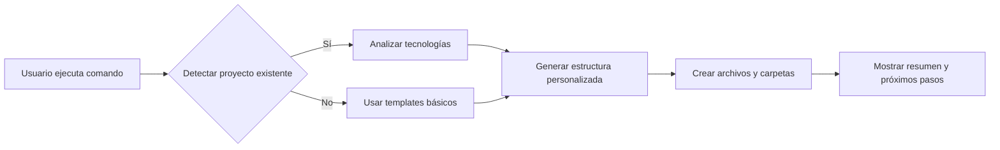

# 🚀 Claude AI Setup - Complete Implementation Guide

## 📋 Table of Contents
1. [Overview](#overview)
2. [Solution Architecture](#solution-architecture)
3. [Option 1: Universal Bash Script](#option-1-universal-bash-script)
4. [Option 2: Global NPM Package](#option-2-global-npm-package)
5. [Option 3: Go CLI](#option-3-go-cli)
6. [Claude Integration](#claude-integration)
7. [Best Practices](#best-practices)
8. [Roadmap and Extensions](#roadmap-and-extensions)

---

## 🎯 Overview

### Objective
Create a reusable command that:
1. Automatically configures `.claude/` structure in any repository
2. Generates documentation files with intelligent templates
3. Integrates seamlessly with Claude AI workflow
4. Is easy to install and maintain

### Key Requirements
- ✅ **Simple**: Single command to configure everything
- ✅ **Portable**: Works on any OS (Mac, Linux, Windows)
- ✅ **Customizable**: Adaptable templates per project
- ✅ **Maintainable**: Clean and well-documented code
- ✅ **Versioned**: Compatible with future updates

---

## 🏗️ Arquitectura de la Solución

### Estructura de Archivos Generados
```
.claude/
├── current/
│   ├── project-state      # Estado general del proyecto
│   ├── active-epic        # Epic/feature en desarrollo
│   └── next-session       # Plan para próxima sesión
├── sessions/
│   └── YYYY-MM-DD/        # Logs organizados por fecha
└── commands/              # Comandos personalizados (opcional)
```

### Flujo de Ejecución


---

## 🛠️ Opción 1: Script Bash Universal (Recomendado para Simplicidad)

### Implementación Completa

```bash
#!/bin/bash
# claude-ai-setup.sh - Universal AI Coding Assistant Setup
# Version: 1.0.0
# Author: Your Name
# License: MIT

set -e  # Exit on error

# Colors for output
RED='\033[0;31m'
GREEN='\033[0;32m'
BLUE='\033[0;34m'
YELLOW='\033[1;33m'
NC='\033[0m' # No Color

# Configuration
CLAUDE_DIR=".claude"
CURRENT_DIR="$CLAUDE_DIR/current"
SESSIONS_DIR="$CLAUDE_DIR/sessions"
VERSION="1.0.0"

# Functions
print_banner() {
    echo -e "${BLUE}"
    echo "╔═══════════════════════════════════════════╗"
    echo "║       Claude AI Setup v$VERSION           ║"
    echo "║   AI Coding Assistant Methodology         ║"
    echo "╚═══════════════════════════════════════════╝"
    echo -e "${NC}"
}

detect_project_type() {
    local project_type="generic"
    
    if [ -f "package.json" ]; then
        project_type="node"
        echo -e "${GREEN}✓${NC} Detected: Node.js/JavaScript project"
    elif [ -f "requirements.txt" ] || [ -f "setup.py" ]; then
        project_type="python"
        echo -e "${GREEN}✓${NC} Detected: Python project"
    elif [ -f "go.mod" ]; then
        project_type="go"
        echo -e "${GREEN}✓${NC} Detected: Go project"
    elif [ -f "Cargo.toml" ]; then
        project_type="rust"
        echo -e "${GREEN}✓${NC} Detected: Rust project"
    else
        echo -e "${YELLOW}ℹ${NC} No specific framework detected, using generic templates"
    fi
    
    echo "$project_type"
}

create_directory_structure() {
    echo -e "\n${BLUE}Creating directory structure...${NC}"
    
    mkdir -p "$CURRENT_DIR"
    mkdir -p "$SESSIONS_DIR/$(date +%Y-%m-%d)"
    
    echo -e "${GREEN}✓${NC} Created $CLAUDE_DIR/"
    echo -e "${GREEN}✓${NC} Created $CURRENT_DIR/"
    echo -e "${GREEN}✓${NC} Created $SESSIONS_DIR/"
}

get_project_name() {
    local name=$(basename "$PWD")
    
    # Try to get from package.json if exists
    if [ -f "package.json" ]; then
        local pkg_name=$(grep -m1 '"name"' package.json | sed 's/.*"name": *"\([^"]*\)".*/\1/')
        if [ ! -z "$pkg_name" ]; then
            name="$pkg_name"
        fi
    fi
    
    echo "$name"
}

create_project_state() {
    local project_type="$1"
    local project_name=$(get_project_name)
    
    echo -e "\n${BLUE}Creating project-state file...${NC}"
    
    cat > "$CURRENT_DIR/project-state" << EOF
# Project State - $project_name

## Overview
[Descripción general del proyecto y sus objetivos principales]

## Current Phase
Planning

## Key Milestones
- [ ] Project Setup Complete
- [ ] Core Architecture Defined
- [ ] MVP Development
- [ ] Testing Implementation
- [ ] Production Deployment

## Architecture Overview
EOF

    # Add project-specific architecture hints
    case "$project_type" in
        "node")
            cat >> "$CURRENT_DIR/project-state" << EOF
- Frontend: [React/Vue/Angular/Vanilla]
- Backend: [Express/Nest/Next/None]
- Database: [PostgreSQL/MongoDB/SQLite/None]
- Testing: [Jest/Mocha/Vitest]
EOF
            ;;
        "python")
            cat >> "$CURRENT_DIR/project-state" << EOF
- Framework: [Django/Flask/FastAPI/None]
- Database: [PostgreSQL/MySQL/SQLite/None]
- Testing: [pytest/unittest]
EOF
            ;;
        *)
            cat >> "$CURRENT_DIR/project-state" << EOF
[Describir arquitectura del sistema]
EOF
            ;;
    esac

    cat >> "$CURRENT_DIR/project-state" << EOF

## Technology Stack
EOF

    # Add detected technologies
    case "$project_type" in
        "node")
            echo "- Node.js" >> "$CURRENT_DIR/project-state"
            [ -f "tsconfig.json" ] && echo "- TypeScript" >> "$CURRENT_DIR/project-state"
            ;;
        "python")
            echo "- Python" >> "$CURRENT_DIR/project-state"
            ;;
        "go")
            echo "- Go" >> "$CURRENT_DIR/project-state"
            ;;
        "rust")
            echo "- Rust" >> "$CURRENT_DIR/project-state"
            ;;
    esac

    cat >> "$CURRENT_DIR/project-state" << EOF
[Agregar otras tecnologías utilizadas]

## Known Issues & Dependencies
None identified yet.

## Development Guidelines
- Follow existing code conventions
- Write tests for new features
- Update documentation as needed

Last Updated: $(date +%Y-%m-%d)
EOF

    echo -e "${GREEN}✓${NC} Created project-state with intelligent defaults"
}

create_active_epic() {
    echo -e "\n${BLUE}Creating active-epic file...${NC}"
    
    cat > "$CURRENT_DIR/active-epic" << 'EOF'
# Active Epic - [Nombre del Epic]

## Epic Goal
[Objetivo principal del epic actual]

## Success Criteria
[Criterios claros de éxito para considerar el epic completado]

## Tasks Breakdown
- [ ] Task 1: [Descripción detallada]
- [ ] Task 2: [Descripción detallada]
- [ ] Task 3: [Descripción detallada]

## Technical Approach
[Enfoque técnico para implementar este epic]

## Dependencies
[Dependencias técnicas o de otros equipos]

## Estimated Timeline
Start Date: [Fecha]
Target Completion: [Fecha]

## Progress Notes
[Notas sobre el progreso actual]

Last Updated: $(date +%Y-%m-%d)
EOF

    echo -e "${GREEN}✓${NC} Created active-epic template"
}

create_next_session() {
    echo -e "\n${BLUE}Creating next-session file...${NC}"
    
    cat > "$CURRENT_DIR/next-session" << EOF
# Next Session Plan

## Session Objective
[Objetivo específico para la próxima sesión de trabajo]

## Priority Tasks
1. [Tarea específica con detalles técnicos]
2. [Tarea específica con detalles técnicos]
3. [Tarea específica con detalles técnicos]

## Technical Context
[Contexto técnico relevante para las tareas]

## Files to Modify
- \`[ruta/archivo1.ext]\` - [Razón para modificar]
- \`[ruta/archivo2.ext]\` - [Razón para modificar]

## Expected Outcomes
[Resultados esperados al finalizar la sesión]

## Notes & Considerations
[Notas importantes o consideraciones especiales]

## Session Log Reference
Will be created: \`$SESSIONS_DIR/$(date +%Y-%m-%d)/[TIMESTAMP]_session_[TASK]\`

Last Updated: $(date +%Y-%m-%d)
EOF

    echo -e "${GREEN}✓${NC} Created next-session template"
}

create_gitignore_entry() {
    echo -e "\n${BLUE}Updating .gitignore...${NC}"
    
    # Check if .gitignore exists
    if [ -f ".gitignore" ]; then
        # Check if already has claude entries
        if ! grep -q "claude/sessions" .gitignore; then
            echo -e "\n# AI Assistant Documentation" >> .gitignore
            echo "$CLAUDE_DIR/sessions/" >> .gitignore
            echo -e "${GREEN}✓${NC} Added Claude sessions to .gitignore"
        else
            echo -e "${YELLOW}ℹ${NC} .gitignore already configured"
        fi
    else
        # Create new .gitignore
        cat > .gitignore << EOF
# AI Assistant Documentation
$CLAUDE_DIR/sessions/
EOF
        echo -e "${GREEN}✓${NC} Created .gitignore with Claude configuration"
    fi
}

create_readme_section() {
    echo -e "\n${BLUE}Creating README documentation...${NC}"
    
    cat > "$CLAUDE_DIR/README.md" << EOF
# Claude AI Assistant Documentation

This project uses the Claude AI Coding Assistant methodology for development.

## Structure

- \`current/\` - Active documentation for current work
  - \`project-state\` - Overall project status and architecture
  - \`active-epic\` - Current epic/feature being developed
  - \`next-session\` - Plan for the next coding session
- \`sessions/\` - Historical session logs (gitignored)

## Usage

1. **Before starting work**: Update \`current/next-session\` with your plan
2. **During work**: Keep \`current/active-epic\` updated with progress
3. **After major changes**: Update \`current/project-state\`

## AI Assistant Integration

When working with Claude or other AI assistants:
1. The AI will read files in \`current/\` to understand context
2. Session logs are automatically created in \`sessions/\`
3. Use the documentation to maintain continuity between sessions

## Quick Commands

\`\`\`bash
# View current project state
cat $CURRENT_DIR/project-state

# Update next session plan
\$EDITOR $CURRENT_DIR/next-session

# Check active epic
cat $CURRENT_DIR/active-epic
\`\`\`

Generated by claude-ai-setup v$VERSION
EOF

    echo -e "${GREEN}✓${NC} Created Claude README documentation"
}

show_summary() {
    echo -e "\n${GREEN}════════════════════════════════════════════${NC}"
    echo -e "${GREEN}✅ Claude AI Setup Complete!${NC}"
    echo -e "${GREEN}════════════════════════════════════════════${NC}"
    
    echo -e "\n${BLUE}Created structure:${NC}"
    tree -L 3 "$CLAUDE_DIR" 2>/dev/null || {
        echo "$CLAUDE_DIR/"
        echo "├── current/"
        echo "│   ├── project-state"
        echo "│   ├── active-epic"
        echo "│   └── next-session"
        echo "├── sessions/"
        echo "│   └── $(date +%Y-%m-%d)/"
        echo "└── README.md"
    }
    
    echo -e "\n${YELLOW}Next steps:${NC}"
    echo "1. Edit $CURRENT_DIR/project-state with your project details"
    echo "2. Define your first epic in $CURRENT_DIR/active-epic"
    echo "3. Plan your session in $CURRENT_DIR/next-session"
    echo "4. Start coding with AI assistance!"
    
    echo -e "\n${BLUE}Pro tip:${NC} Add this alias to your shell:"
    echo "alias claude-plan='$EDITOR $CURRENT_DIR/next-session'"
    echo "alias claude-status='cat $CURRENT_DIR/project-state'"
}

# Main execution
main() {
    print_banner
    
    # Check if .claude already exists
    if [ -d "$CLAUDE_DIR" ]; then
        echo -e "${YELLOW}Warning:${NC} $CLAUDE_DIR already exists in this project."
        read -p "Do you want to overwrite it? (y/N): " -n 1 -r
        echo
        if [[ ! $REPLY =~ ^[Yy]$ ]]; then
            echo -e "${RED}Setup cancelled.${NC}"
            exit 1
        fi
        rm -rf "$CLAUDE_DIR"
    fi
    
    # Detect project type
    PROJECT_TYPE=$(detect_project_type)
    
    # Create structure
    create_directory_structure
    
    # Create files
    create_project_state "$PROJECT_TYPE"
    create_active_epic
    create_next_session
    create_gitignore_entry
    create_readme_section
    
    # Show summary
    show_summary
}

# Run main function
main
```

### Instalación y Uso

```bash
# 1. Descargar el script
curl -o claude-ai-setup.sh https://raw.githubusercontent.com/tu-usuario/claude-ai-setup/main/claude-ai-setup.sh

# 2. Hacer ejecutable
chmod +x claude-ai-setup.sh

# 3. Mover a PATH global (opcional)
sudo mv claude-ai-setup.sh /usr/local/bin/claude-ai-setup

# 4. Usar en cualquier proyecto
cd /tu/proyecto
claude-ai-setup
```

---

## 📦 Opción 2: Paquete NPM Global (Mejor para Ecosistema Node.js)

### Estructura del Proyecto

```
claude-ai-setup/
├── package.json
├── index.js
├── lib/
│   ├── detector.js      # Detecta tipo de proyecto
│   ├── generator.js     # Genera archivos
│   └── templates.js     # Templates de documentos
├── templates/
│   ├── project-state/
│   │   ├── default.md
│   │   ├── node.md
│   │   └── python.md
│   └── ...
└── README.md
```

### Implementación package.json

```json
{
  "name": "@claude/ai-setup",
  "version": "1.0.0",
  "description": "Setup AI Coding Assistant methodology for any project",
  "main": "index.js",
  "bin": {
    "claude-setup": "./index.js"
  },
  "files": [
    "index.js",
    "lib/",
    "templates/"
  ],
  "scripts": {
    "test": "jest",
    "lint": "eslint .",
    "prepublishOnly": "npm test && npm run lint"
  },
  "keywords": ["claude", "ai", "setup", "methodology", "coding-assistant"],
  "author": "Your Name",
  "license": "MIT",
  "dependencies": {
    "chalk": "^5.3.0",
    "commander": "^11.1.0",
    "inquirer": "^9.2.12",
    "ora": "^6.3.1",
    "fs-extra": "^11.2.0"
  },
  "devDependencies": {
    "eslint": "^8.55.0",
    "jest": "^29.7.0"
  },
  "engines": {
    "node": ">=14.0.0"
  }
}
```

### Implementación index.js

```javascript
#!/usr/bin/env node

import { Command } from 'commander';
import chalk from 'chalk';
import inquirer from 'inquirer';
import ora from 'ora';
import { detectProjectType } from './lib/detector.js';
import { generateStructure } from './lib/generator.js';
import { version } from './package.json' assert { type: 'json' };

const program = new Command();

program
  .name('claude-setup')
  .description('Setup AI Coding Assistant methodology for your project')
  .version(version)
  .option('-f, --force', 'Overwrite existing .claude directory')
  .option('-t, --type <type>', 'Force project type (node, python, go, rust)')
  .option('-i, --interactive', 'Interactive mode with prompts')
  .option('-q, --quiet', 'Quiet mode, minimal output')
  .action(async (options) => {
    console.log(chalk.blue.bold('\n🤖 Claude AI Setup\n'));

    const spinner = ora('Analyzing project...').start();

    try {
      // Detect project type
      const detectedType = await detectProjectType();
      const projectType = options.type || detectedType;
      
      spinner.succeed(`Detected project type: ${chalk.green(projectType)}`);

      // Interactive mode
      let config = {
        projectType,
        projectName: path.basename(process.cwd()),
        includeGitignore: true,
        includeReadme: true
      };

      if (options.interactive) {
        const answers = await inquirer.prompt([
          {
            type: 'input',
            name: 'projectName',
            message: 'Project name:',
            default: config.projectName
          },
          {
            type: 'confirm',
            name: 'includeGitignore',
            message: 'Update .gitignore?',
            default: true
          },
          {
            type: 'confirm',
            name: 'includeReadme',
            message: 'Create Claude README?',
            default: true
          }
        ]);
        
        config = { ...config, ...answers };
      }

      // Generate structure
      spinner.start('Creating Claude structure...');
      await generateStructure(config, options);
      spinner.succeed('Structure created successfully!');

      // Show summary
      if (!options.quiet) {
        showSummary(config);
      }

    } catch (error) {
      spinner.fail(chalk.red(error.message));
      process.exit(1);
    }
  });

program.parse();

function showSummary(config) {
  console.log(chalk.green('\n✅ Setup complete!\n'));
  console.log(chalk.blue('Created structure:'));
  console.log(`
  .claude/
  ├── current/
  │   ├── project-state
  │   ├── active-epic
  │   └── next-session
  ├── sessions/
  └── README.md
  `);
  
  console.log(chalk.yellow('\n📝 Next steps:'));
  console.log('1. Edit .claude/current/project-state');
  console.log('2. Define your epic in .claude/current/active-epic');
  console.log('3. Plan your session in .claude/current/next-session');
  console.log('\n' + chalk.blue('Happy coding with Claude! 🚀'));
}
```

### Implementación lib/detector.js

```javascript
import fs from 'fs-extra';
import path from 'path';

export async function detectProjectType() {
  const checks = [
    { file: 'package.json', type: 'node' },
    { file: 'requirements.txt', type: 'python' },
    { file: 'setup.py', type: 'python' },
    { file: 'go.mod', type: 'go' },
    { file: 'Cargo.toml', type: 'rust' },
    { file: 'pom.xml', type: 'java' },
    { file: 'composer.json', type: 'php' },
    { file: 'Gemfile', type: 'ruby' }
  ];

  for (const check of checks) {
    if (await fs.pathExists(check.file)) {
      return check.type;
    }
  }

  return 'generic';
}

export async function getProjectMetadata() {
  const metadata = {
    name: path.basename(process.cwd()),
    hasGit: await fs.pathExists('.git'),
    hasTests: false,
    hasDocs: await fs.pathExists('docs') || await fs.pathExists('documentation'),
    dependencies: []
  };

  // Try to get project name from package.json
  if (await fs.pathExists('package.json')) {
    try {
      const pkg = await fs.readJson('package.json');
      metadata.name = pkg.name || metadata.name;
      metadata.dependencies = Object.keys(pkg.dependencies || {});
      metadata.hasTests = !!(pkg.scripts && (pkg.scripts.test || pkg.scripts.jest));
    } catch (e) {
      // Ignore parsing errors
    }
  }

  return metadata;
}
```

### Publicación e Instalación

```bash
# Publicar en NPM
npm publish --access public

# Instalar globalmente
npm install -g @claude/ai-setup

# Usar en cualquier proyecto
cd /cualquier/proyecto
claude-setup

# Con opciones
claude-setup --interactive
claude-setup --type python --force
```

---

## 🔧 Opción 3: CLI con Go (Máxima Portabilidad)

### Ventajas de Go
- Binario único sin dependencias
- Funciona en todos los OS
- Muy rápido
- Fácil distribución

### Implementación main.go

```go
package main

import (
    "embed"
    "flag"
    "fmt"
    "os"
    "path/filepath"
    "text/template"
    "time"

    "github.com/fatih/color"
)

//go:embed templates/*
var templates embed.FS

type Config struct {
    ProjectName string
    ProjectType string
    Date        string
    ClaudeDir   string
}

func main() {
    var (
        force       = flag.Bool("force", false, "Overwrite existing .claude directory")
        projectType = flag.String("type", "auto", "Project type (auto, node, python, go, rust)")
        quiet       = flag.Bool("quiet", false, "Minimal output")
    )
    flag.Parse()

    if !*quiet {
        printBanner()
    }

    config := &Config{
        ProjectName: filepath.Base(mustGetwd()),
        Date:        time.Now().Format("2006-01-02"),
        ClaudeDir:   ".claude",
    }

    // Detect project type
    if *projectType == "auto" {
        config.ProjectType = detectProjectType()
        color.Green("✓ Detected project type: %s\n", config.ProjectType)
    } else {
        config.ProjectType = *projectType
    }

    // Check if .claude exists
    if _, err := os.Stat(config.ClaudeDir); !os.IsNotExist(err) && !*force {
        color.Yellow("⚠ .claude directory already exists. Use --force to overwrite.\n")
        os.Exit(1)
    }

    // Create structure
    if err := createStructure(config); err != nil {
        color.Red("✗ Error: %v\n", err)
        os.Exit(1)
    }

    if !*quiet {
        showSummary(config)
    }
}

func detectProjectType() string {
    checks := map[string]string{
        "package.json":     "node",
        "requirements.txt": "python",
        "go.mod":          "go",
        "Cargo.toml":      "rust",
    }

    for file, projectType := range checks {
        if _, err := os.Stat(file); err == nil {
            return projectType
        }
    }

    return "generic"
}

func createStructure(config *Config) error {
    dirs := []string{
        filepath.Join(config.ClaudeDir, "current"),
        filepath.Join(config.ClaudeDir, "sessions", config.Date),
    }

    for _, dir := range dirs {
        if err := os.MkdirAll(dir, 0755); err != nil {
            return err
        }
    }

    files := map[string]string{
        "project-state": "templates/project-state.md",
        "active-epic":   "templates/active-epic.md",
        "next-session":  "templates/next-session.md",
    }

    for name, templatePath := range files {
        if err := generateFile(config, name, templatePath); err != nil {
            return err
        }
    }

    return nil
}

func generateFile(config *Config, name, templatePath string) error {
    tmplContent, err := templates.ReadFile(templatePath)
    if err != nil {
        return err
    }

    tmpl, err := template.New(name).Parse(string(tmplContent))
    if err != nil {
        return err
    }

    outputPath := filepath.Join(config.ClaudeDir, "current", name)
    file, err := os.Create(outputPath)
    if err != nil {
        return err
    }
    defer file.Close()

    return tmpl.Execute(file, config)
}
```

### Compilación y Distribución

```bash
# Compilar para múltiples plataformas
GOOS=darwin GOARCH=amd64 go build -o claude-setup-mac
GOOS=linux GOARCH=amd64 go build -o claude-setup-linux
GOOS=windows GOARCH=amd64 go build -o claude-setup.exe

# Crear script de instalación
cat > install.sh << 'EOF'
#!/bin/bash
OS=$(uname -s | tr '[:upper:]' '[:lower:]')
ARCH=$(uname -m)

if [ "$OS" = "darwin" ]; then
    URL="https://github.com/user/claude-setup/releases/latest/download/claude-setup-mac"
elif [ "$OS" = "linux" ]; then
    URL="https://github.com/user/claude-setup/releases/latest/download/claude-setup-linux"
else
    echo "Unsupported OS"
    exit 1
fi

curl -L "$URL" -o /tmp/claude-setup
chmod +x /tmp/claude-setup
sudo mv /tmp/claude-setup /usr/local/bin/claude-setup
echo "✅ claude-setup installed successfully!"
EOF
```

---

## 🔌 Integración con Claude

### 1. Comando Personalizado en Claude

Crear `.claude/commands/initial-setup.md`:

```markdown
# Initial Setup Command

When this command is run, execute the following:
1. Check for existing .claude directory
2. Create the standard structure
3. Generate templates based on project type
4. Update .gitignore
5. Show summary and next steps

Use the claude-ai-setup tool if available, otherwise create manually.
```

### 2. Auto-detección en Claude

Agregar a `CLAUDE.md` en la raíz:

```markdown
# Claude AI Instructions

## Project Setup
If no .claude directory exists, suggest running:
```bash
npx @claude/ai-setup
```

## Documentation Structure
Always check .claude/current/ for:
- project-state: Overall project status
- active-epic: Current work focus
- next-session: Planned tasks
```

---

## 📋 Mejores Prácticas

### 1. Versionado de Templates
```javascript
// templates/version.js
export const TEMPLATE_VERSION = '1.0.0';

export function migrateTemplates(fromVersion, toVersion) {
  // Logic to update old templates
}
```

### 2. Configuración Personalizable
```json
// .claude-setup.json
{
  "templates": {
    "source": "github:user/my-templates",
    "version": "2.0.0"
  },
  "defaults": {
    "includeGitignore": true,
    "sessionFormat": "markdown"
  }
}
```

### 3. Hooks y Plugins
```javascript
// Permitir hooks personalizados
export async function runHooks(stage, config) {
  const hooksFile = path.join(process.cwd(), '.claude-hooks.js');
  if (await fs.pathExists(hooksFile)) {
    const hooks = await import(hooksFile);
    if (hooks[stage]) {
      await hooks[stage](config);
    }
  }
}
```

### 4. Integración con CI/CD
```yaml
# .github/workflows/claude-setup.yml
name: Verify Claude Setup
on: [push, pull_request]

jobs:
  verify:
    runs-on: ubuntu-latest
    steps:
      - uses: actions/checkout@v3
      - name: Check Claude structure
        run: |
          if [ ! -d ".claude" ]; then
            echo "::warning::.claude directory missing"
            npx @claude/ai-setup --quiet
          fi
```

---

## 🚀 Roadmap y Extensiones

### Fase 1: MVP (Actual)
- ✅ Setup básico de estructura
- ✅ Detección de tipo de proyecto
- ✅ Templates personalizables

### Fase 2: Integraciones
- [ ] Plugin para VSCode
- [ ] Integración con GitHub Actions
- [ ] Sync con Claude Cloud (hipotético)

### Fase 3: Colaboración
- [ ] Compartir templates entre equipos
- [ ] Métricas de uso de AI
- [ ] Best practices automáticas

### Fase 4: Inteligencia
- [ ] Análisis de codebase para sugerencias
- [ ] Auto-generación de epics basado en issues
- [ ] Predicción de tareas para próxima sesión

---

## 🎯 Conclusión

### Recomendación Final

Para **máxima simplicidad y adopción**, recomiendo:

1. **Empezar con el Script Bash** para validar el concepto
2. **Evolucionar a NPM package** cuando tengas usuarios
3. **Considerar Go** solo si necesitas distribución empresarial

### Características Clave para el Éxito

1. **Zero Config**: Debe funcionar sin configuración
2. **Smart Defaults**: Detectar y sugerir inteligentemente
3. **Extensible**: Permitir personalización sin complejidad
4. **Well Documented**: Documentación clara es crítica
5. **Version Control**: Manejar actualizaciones elegantemente

### Código de Ejemplo para Empezar

```bash
# 1. Crea el script
curl -o setup.sh https://gist.github.com/[tu-gist]/claude-setup.sh
chmod +x setup.sh

# 2. Úsalo
./setup.sh

# 3. Compártelo
echo "alias claude-init='curl -s https://[url]/setup.sh | bash'" >> ~/.bashrc
```

Con esta guía tienes todo lo necesario para crear una herramienta profesional, mantenible y fácil de usar que transformará cómo los desarrolladores trabajan con AI coding assistants.